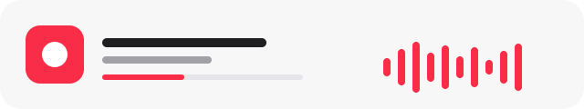

<div align="center">


# iMusicActivity

Apple Music on Windows, live on Discord.

<br>



<br><br>

<a href="https://github.com/Suraj64x/AppleMusicActivity/releases/download/v1.4.0/iMusicActivity.exe">
  
</a>
&nbsp;
<a href="https://github.com/Suraj64x/AppleMusicActivity/releases/tag/v1.4.0">
  
</a>

<br><br>


<br><br>


<br><br>

<table>
  <tr>
    <td align="center" width="200">
      <br>
      <b>Presence</b><br>
      <sub>Song, artist, album, art, time</sub>
    </td>
    <td align="center" width="200">
      <br>
      <b>Scrobble</b><br>
      <sub>Last.fm and ListenBrainz</sub>
    </td>
    <td align="center" width="200">
      <br>
      <b>Quiet</b><br>
      <sub>Lives in the tray</sub>
    </td>
  </tr>
</table>

<br>

Play Apple Music. Discord shows it.<br>
Optional lyrics. Optional scrobbles. One tray icon.

</div>

<br>

##  Install

 &nbsp;[Download v1.4.0](https://github.com/Suraj64x/AppleMusicActivity/releases/download/v1.4.0/iMusicActivity.exe)<br>
 &nbsp;Use [Apple Music from the Store](https://apps.microsoft.com/detail/9PFHDD62MXS1)<br>
 &nbsp;Install [.NET 10 Desktop Runtime](https://dotnet.microsoft.com/en-us/download/dotnet/10.0) if Windows asks<br>
 &nbsp;Run the exe, then turn on Discord **Activity Status**

> [!TIP]
> Keep Apple Music and iMusicActivity on the same virtual desktop.

<br>

##  Setup

Double-click the tray icon.

<table>
  <tr>
    <td align="center" width="300">
      <b>Last.fm</b><br>
      <sub>API key, secret, username, password</sub>
    </td>
    <td align="center" width="300">
      <b>ListenBrainz</b><br>
      <sub>User token</sub>
    </td>
  </tr>
</table>

 &nbsp;Passwords live in Windows Credential Manager. Offline listens are not saved.

<br>

##  Build

```bat
dotnet publish iMusicActivity/iMusicActivity.csproj -c Release -r win-x64 --self-contained false -p:PublishSingleFile=true
```

Logs live in `%localappdata%\iMusicActivity`. Something off? [Open an issue](https://github.com/Suraj64x/AppleMusicActivity/issues).

<br>

<div align="center">


<br><br>

**Made with love by SMOKiE**

<sub>[GPL-3.0](LICENSE) &nbsp;·&nbsp; includes [AMWin-RP](https://github.com/PKBeam/AMWin-RP) by [PKBeam](https://github.com/PKBeam)</sub>

</div>
