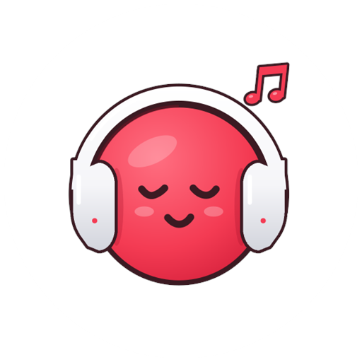
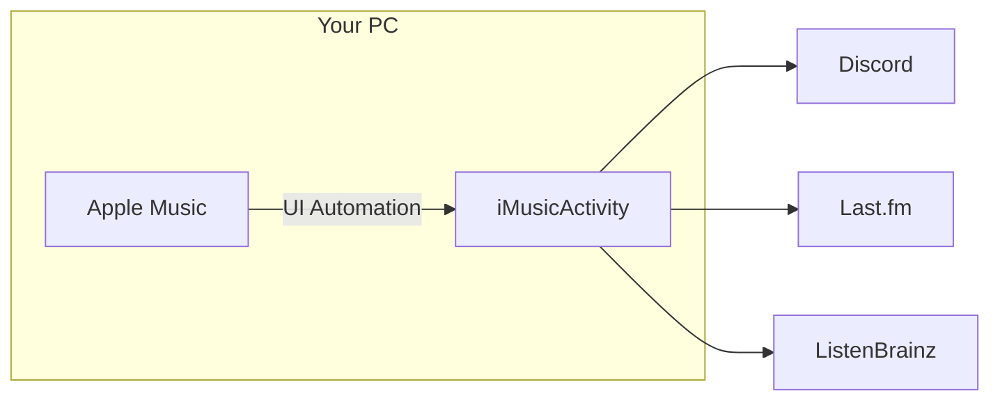

<div align="center">
  

  <h1>iMusicActivity</h1>

  <p>
    <strong>Apple Music on Windows, finally visible.</strong><br/>
    Discord sees the track. Last.fm gets the scrobble. You stay in the tray.
  </p>

  <p>
    <a href="https://github.com/Suraj64x/AppleMusicActivity/raw/master/iMusicActivity.exe"></a>
    <a href="LICENSE"></a>
    <a href="https://dotnet.microsoft.com/download/dotnet/10.0"></a>
    <a href="https://apps.microsoft.com/detail/9PFHDD62MXS1"></a>
  </p>

  <p>
    <code>Windows 11 24H2+</code>
    &nbsp;·&nbsp;
    <a href="https://github.com/Suraj64x/AppleMusicActivity/raw/master/iMusicActivity.exe">iMusicActivity.exe</a>
    &nbsp;·&nbsp;
    <a href="https://github.com/Suraj64x/AppleMusicActivity/issues">Issues</a>
  </p>
</div>

---

<table>
  <tr>
    <td width="38%" valign="top">

### Now playing

```
┌─────────────────────────┐
│  ●  Discord             │
│                         │
│  Listening to Apple Music
│  After Hours            │
│  The Weeknd             │
│  ━━━━●────────  1:42    │
└─────────────────────────┘
```

Your friends stop asking what song that is.

    </td>
    <td width="62%" valign="top">

### The idea

The Windows Apple Music app does not talk to Discord. iMusicActivity is the missing wire: a quiet tray process that reads the player, then publishes a full Rich Presence — artwork, timestamps, play and pause, optional lyrics.

Same process can scrobble to **Last.fm** and **ListenBrainz**. One install. No extra windows until you want settings.

    </td>
  </tr>
</table>



---

## Features

<table>
  <tr>
    <td width="33%" valign="top">

**Presence**<br/>
Song, artist, album, cover, elapsed time. Show it only while playing, or keep it up when paused.

    </td>
    <td width="33%" valign="top">

**Lyrics**<br/>
Experimental synced lines on your Discord status. Cache them, clear them, forget they exist.

    </td>
    <td width="33%" valign="top">

**Scrobbles**<br/>
Last.fm and ListenBrainz from the same tray icon. Password stays in Windows Credential Manager.

    </td>
  </tr>
  <tr>
    <td valign="top">

**Languages**<br/>
English, Deutsch, Türkçe, 한국어, 日本語, Русский, Español.

    </td>
    <td valign="top">

**Classical mode**<br/>
Composer as artist when the performer is not the point.

    </td>
    <td valign="top">

**Ghost-quiet**<br/>
Starts with Windows if you want. Lives in the tray. Right-click, Exit.

    </td>
  </tr>
</table>

---

## Install in one click

<p align="center">
  <a href="./iMusicActivity.exe"></a>
</p>

1. Download [`iMusicActivity.exe`](https://github.com/Suraj64x/AppleMusicActivity/raw/master/iMusicActivity.exe) from this repo.
2. Install [Apple Music from the Microsoft Store](https://apps.microsoft.com/detail/9PFHDD62MXS1) if you do not have it.
3. If Windows asks, install the [.NET 10 Desktop Runtime](https://dotnet.microsoft.com/en-us/download/dotnet/10.0).
4. Double-click the exe. Look for the icon in the system tray.

Discord: **Settings → Activity Settings → Activity Privacy → Activity Status** must be on.

> Virtual desktops: keep iMusicActivity and Apple Music on the **same** desktop. That is a platform limit, not a bug.

---

## Scrobbling

Offline listens are discarded. Finish a song with no network and it never happened — to Last.fm, anyway.

| Service | What you paste |
| --- | --- |
| **Last.fm** | API key + secret from [last.fm/api](https://www.last.fm/api), plus username and password |
| **ListenBrainz** | User token |

Last.fm passwords are stored in [Windows Credential Manager](https://support.microsoft.com/en-us/windows/accessing-credential-manager-1b5c916a-6a16-889f-8581-fc16e8165ac0), not a plaintext file.

---

## Build it yourself

```bat
dotnet publish iMusicActivity/iMusicActivity.csproj -c Release -r win-x64 --self-contained false -p:PublishSingleFile=true
```

The finished exe lands in the repo root.

Need the SDK? [.NET 10](https://dotnet.microsoft.com/download/dotnet/10.0). Open `iMusicActivity.sln` in Visual Studio if you would rather click than type.

---

## When it breaks

Logs live in `%localappdata%\iMusicActivity`. Attach them to an [issue](https://github.com/Suraj64x/AppleMusicActivity/issues).

Check first: Discord activity is enabled, Apple Music is the Store app, both windows share a desktop.

---

<div align="center">

**Made with love by SMOKiE**

GPL-3.0 · Includes work from [AMWin-RP](https://github.com/PKBeam/AMWin-RP) by [PKBeam](https://github.com/PKBeam)

<br/>

*Press play. Let Discord keep up.*

</div>
