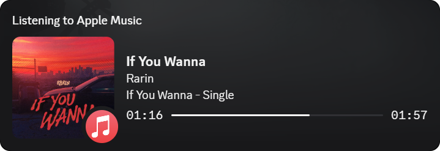

<div align="center">


# iMusicActivity

**Apple Music on Windows, live on Discord.**

<sub>Play a song. Your friends see it.</sub>

<br>



<br>

<a href="https://github.com/Suraj64x/AppleMusicActivity/releases/download/v2.4.0/iMusicActivity.exe">
  
</a>
&nbsp;
<a href="https://github.com/Suraj64x/AppleMusicActivity/releases/tag/v2.4.0">
  
</a>

<br><br>


<br><br>


<br><br>

<table>
  <tr>
    <td align="center" width="200">
      <br>
      <b>Presence</b><br>
      <sub>Song, artist, album, art, time</sub>
    </td>
    <td align="center" width="200">
      <br>
      <b>Scrobble</b><br>
      <sub>Last.fm and ListenBrainz</sub>
    </td>
    <td align="center" width="200">
      <br>
      <b>Quiet</b><br>
      <sub>Lives in the tray</sub>
    </td>
  </tr>
</table>

<br>


&nbsp;
<sub>Optional lyrics &nbsp;·&nbsp; optional scrobbles &nbsp;·&nbsp; one tray icon</sub>
&nbsp;


<br><br>

##  &nbsp;Install

[Download v2.4.0](https://github.com/Suraj64x/AppleMusicActivity/releases/download/v2.4.0/iMusicActivity.exe)<br>
Use [Apple Music from the Store](https://apps.microsoft.com/detail/9PFHDD62MXS1)<br>
Install [.NET 10 Desktop Runtime](https://dotnet.microsoft.com/en-us/download/dotnet/10.0) if Windows asks<br>
Run the exe, then turn on Discord **Activity Status**

<br>

<sub>Keep Apple Music and iMusicActivity on the same virtual desktop.</sub>

<br><br>

##  &nbsp;Setup

Double-click the tray icon.

<table>
  <tr>
    <td align="center" width="280">
      <b>Last.fm</b><br>
      <sub>API key, secret, username, password</sub>
    </td>
    <td align="center" width="280">
      <b>ListenBrainz</b><br>
      <sub>User token</sub>
    </td>
  </tr>
</table>

<sub>Passwords live in Windows Credential Manager. Offline listens are not saved.</sub>

<br><br>

##  &nbsp;Build

```bat
dotnet publish iMusicActivity/iMusicActivity.csproj -c Release -r win-x64 --self-contained false -p:PublishSingleFile=true
```

<sub>Logs live in <code>%localappdata%\iMusicActivity</code> · <a href="https://github.com/Suraj64x/AppleMusicActivity/issues">Open an issue</a></sub>

<br><br>


<br><br>

**Made with love by SMOKiE**

</div>
